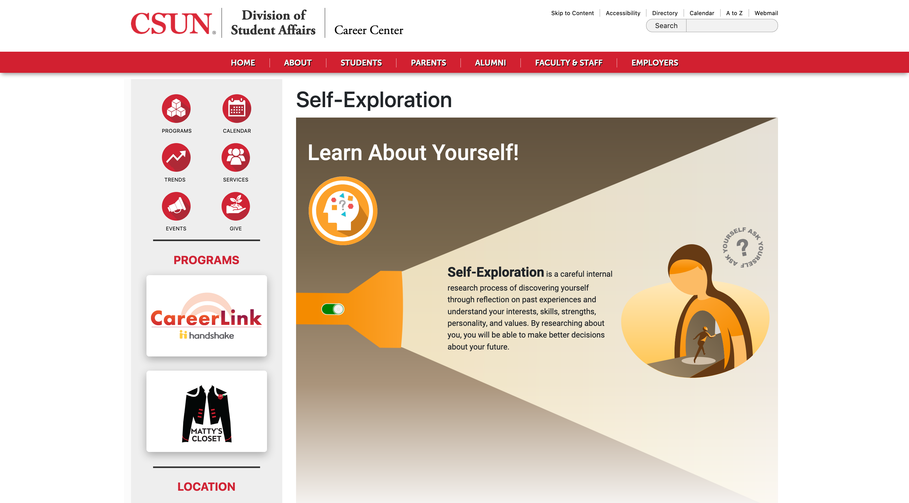
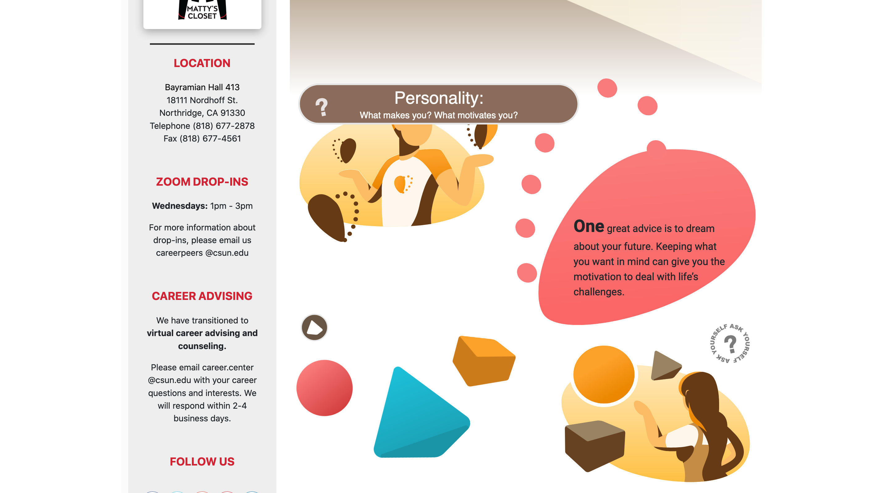
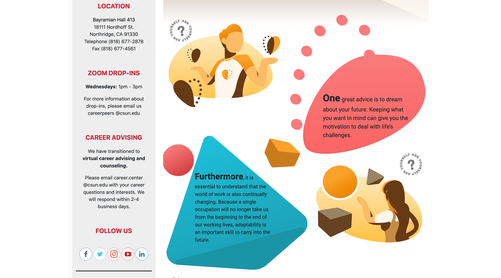
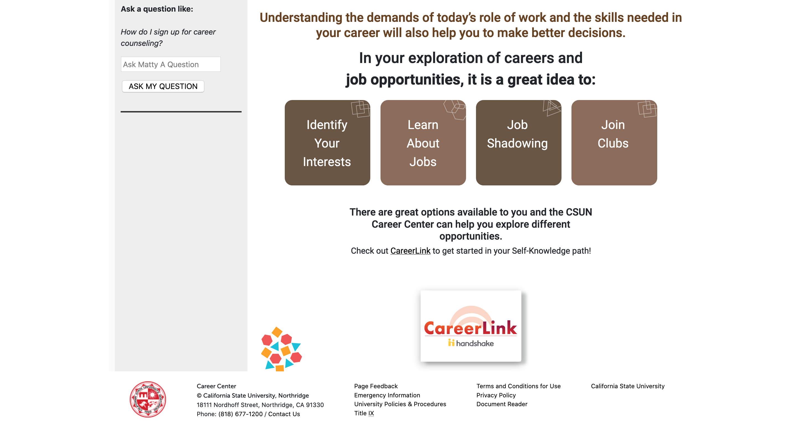
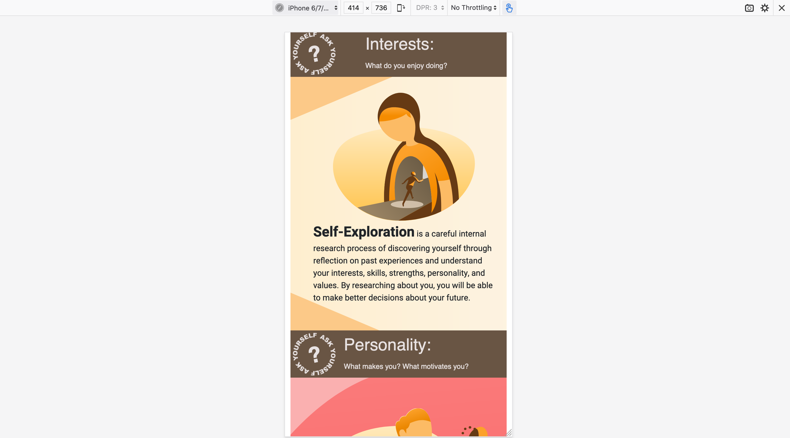
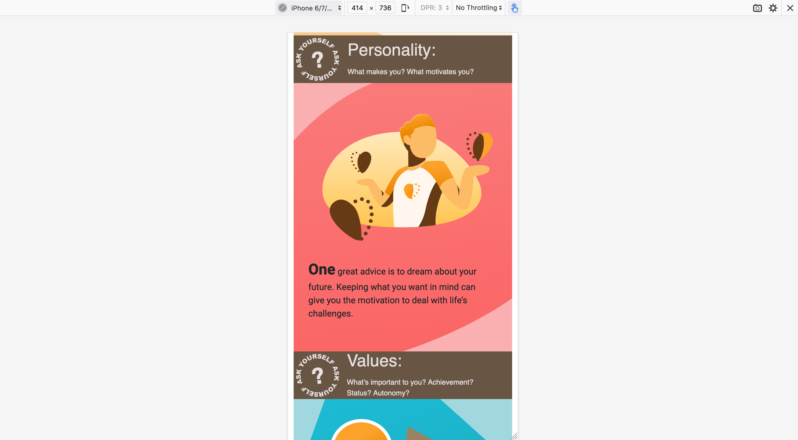

# CSUN Career Center: Self-Exploration Page

An interactive infographic for CSUN's Career Center's website. I was tasked with creating an interactive page to add more content for the Virtual Services section.
The page display information in a meaningful way while increasing engagement with student's exploring the content. There are hover animations, clickable events, static animations, an wonderful designs from our previous illustrator whose assets I used and referenced to create this page. This is one of my very first projects using web development technologies. It was a great learning experience working on it and being part of the Career Center's team.

## Technologies
* HTML
* CSS
* JavaScript

## Contributions
I was given a written script and was given full creative control on how to portray the information given in a meaningful way. The illustrations were not my work but the work of our illustrator. I did create some of my own svg assets to add to the page. Used HTML for the layout of the page. I used CSS and JavaScript for animations, styling, and events.

## Deployment
Visit the site [here](https://www.csun.edu/career/self-exploration)

### Main page

### Hover animaitions

### Interactive SVGs

### Career Center Services

### Responsive Design

